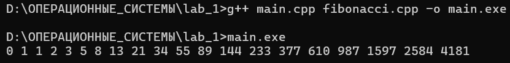
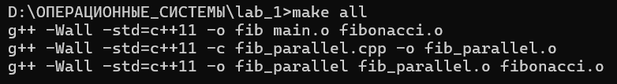
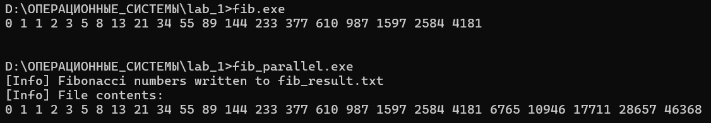

# Лабораторная работа №1

## Выполнил: студент группы 2272, Шишков Артём Евгеньевич

## Исследование компилятора GCC, язык ассемблера. Связь процесса и операционной системы. Makefile.

## Структура проекта

## 1. Программа на C++ (модульная версия)

### fibonacci.h

```cpp
#ifndef FIBONACCI_H
#define FIBONACCI_H

void fibonacci(int n, long long* m);

#endif
```

## fibonacci.cpp

```cpp
#include "fibonacci.h"

void fibonacci(int n, long long* m) {
    if (n <= 0) return;
    m[0] = 0;
    if (n == 1) return;
    m[1] = 1;
    for (int i = 2; i < n; ++i) {
        m[i] = m[i-1] + m[i-2];
    }
}
```

## main.cpp

```cpp
#include <iostream>
#include "fibonacci.h"
using namespace std;

int main() {
    const int N = 20;
    long long m[N];
    fibonacci(N, m);
    for (int i = 0; i < N; ++i)
        cout << m[i] << " ";
    cout << endl;
}
```

## Компиляция и запуск


## Оптимизация O0 (без оптимизации)

```assembly
	.file	"fibonacci.cpp"            ; Исходный файл
	.text                                ; Начало секции кода
	.globl	_Z9fibonacciiPx              ; Делаем функцию видимой для линковщика
	.def	_Z9fibonacciiPx;            ; Определение отладочной информации для функции
	.scl	2;                          ; Класс хранения: 2 = глобальный
	.type	32;                         ; Тип: 32 = функция
	.endef                               ; Конец определения
	.seh_proc	_Z9fibonacciiPx          ; Начало SEH-процедуры для обработки исключений
_Z9fibonacciiPx:                         ; Точка входа (mangled name)
.LFB0:                                   ; Метка начала функции (Local Function Begin 0)
	pushq	%rbp                         ; Сохраняем rbp вызывающей стороны в стеке
	.seh_pushreg	%rbp                 ; SEH: зафиксировали сохранение регистра rbp
	movq	%rsp, %rbp                   ; Теперь rbp = rsp (указатель на текущий кадр стека)
	.seh_setframe	%rbp, 0              ; SEH: установили фрейм со смещением 0
	subq	$16, %rsp                    ; Выделяем 16 байт под локальные переменные
	.seh_stackalloc	16                   ; SEH: зафиксировали выделение 16 байт стека
	.seh_endprologue                     ; Конец пролога SEH

	; === Сохранение параметров функции в стек ===
	; Соглашение Microsoft x64: 1-й целый аргумент в rcx, 2-й в rdx
	movl	%ecx, 16(%rbp)               ; n (int) — сохраняем из ecx в [rbp+16]
	movq	%rdx, 24(%rbp)               ; arr (long long*) — сохраняем из rdx в [rbp+24]

	; === if (n <= 0) return; ===
	cmpl	$0, 16(%rbp)                 ; Сравниваем n (rbp+16) с нулём
	jle	.L7                              ; Если n <= 0, переходим к выходу

	; === arr[0] = 0; ===
	movq	24(%rbp), %rax               ; rax = адрес массива arr
	movq	$0, (%rax)                   ; arr[0] = 0 (записываем 8 байт нуля)

	; === if (n == 1) return; ===
	cmpl	$1, 16(%rbp)                 ; Сравниваем n с 1
	je	.L8                              ; Если n == 1, переходим к выходу

	; === arr[1] = 1; ===
	movq	24(%rbp), %rax               ; rax = arr
	addq	$8, %rax                     ; rax = arr + 8 (адрес arr[1])
	movq	$1, (%rax)                   ; arr[1] = 1

	; === for (int i = 2; ...) — инициализация ===
	movl	$2, -4(%rbp)                 ; i = 2, храним в [rbp-4]
	jmp	.L5                              ; Переход к проверке условия цикла

.L6:                                     ; ========== ТЕЛО ЦИКЛА ==========

	; --- Читаем arr[i-1] ---
	movl	-4(%rbp), %eax               ; eax = i (32 бита)
	cltq                                 ; Расширяем знаково eax → rax (теперь i 64-битное)
	salq	$3, %rax                     ; rax = i * 8 (размер long long)
	leaq	-8(%rax), %rdx               ; rdx = i*8 - 8 = (i-1)*8
	movq	24(%rbp), %rax               ; rax = arr
	addq	%rdx, %rax                   ; rax = arr + (i-1)*8 = &arr[i-1]
	movq	(%rax), %rcx                 ; rcx = arr[i-1]  (сохраняем в rcx)

	; --- Читаем arr[i-2] ---
	movl	-4(%rbp), %eax               ; eax = i
	cltq                                 ; rax = i
	salq	$3, %rax                     ; rax = i * 8
	leaq	-16(%rax), %rdx              ; rdx = i*8 - 16 = (i-2)*8
	movq	24(%rbp), %rax               ; rax = arr
	addq	%rdx, %rax                   ; rax = arr + (i-2)*8 = &arr[i-2]
	movq	(%rax), %rdx                 ; rdx = arr[i-2]

	; --- Вычисляем адрес arr[i] и записываем сумму ---
	movl	-4(%rbp), %eax               ; eax = i
	cltq                                 ; rax = i
	leaq	0(,%rax,8), %r8              ; r8 = i * 8
	movq	24(%rbp), %rax               ; rax = arr
	addq	%r8, %rax                    ; rax = arr + i*8 = &arr[i]
	addq	%rcx, %rdx                   ; rdx = arr[i-1] + arr[i-2]
	movq	%rdx, (%rax)                 ; arr[i] = сумма

	; --- ++i ---
	addl	$1, -4(%rbp)                 ; i = i + 1

.L5:                                     ; ========== ПРОВЕРКА УСЛОВИЯ ЦИКЛА ==========
	movl	-4(%rbp), %eax               ; eax = i
	cmpl	16(%rbp), %eax               ; Сравниваем i с n
	jl	.L6                              ; Если i < n, повторяем цикл
	jmp	.L1                              ; Иначе выходим

.L7:                                     ; Случай n <= 0
	nop                                  ; Выравнивание/заглушка
	jmp	.L1                              ; Переход к выходу

.L8:                                     ; Случай n == 1
	nop                                  ; Выравнивание/заглушка

.L1:                                     ; ========== ЭПИЛОГ ==========
	addq	$16, %rsp                    ; Освобождаем 16 байт локальных переменных
	popq	%rbp                         ; Восстанавливаем rbp вызывающей стороны
	ret                                  ; Возврат из функции
	.seh_endproc                         ; Конец SEH-процедуры

	.ident	"GCC: (MinGW-W64 x86_64-ucrt-posix-seh, built by Brecht Sanders, r3) 14.2.0"
```

## Оптимизация O3

```assembly
	.file	"fibonacci.cpp"            ; Исходный файл
	.text                                ; Начало секции кода
	.p2align 4                           ; Выравнивание начала функции на 16 байт
	.globl	_Z9fibonacciiPx              ; Глобальный символ
	.def	_Z9fibonacciiPx;            ; Определение отладочной информации
	.scl	2;                          ; Класс хранения: глобальный
	.type	32;                         ; Тип: функция
	.endef                               ; Конец определения
	.seh_proc	_Z9fibonacciiPx          ; Начало SEH-процедуры
_Z9fibonacciiPx:                         ; Точка входа
.LFB0:                                   ; Метка начала функции
	.seh_endprologue                     ; Пролог пустой — стек не используется!

	; === Сохраняем n в r10d, чтобы не потерять ===
	; Соглашение Microsoft x64: ecx = n (int), rdx = arr (long long*)
	movl	%ecx, %r10d                  ; r10d = n (сохраняем копию для финальных проверок)

	; === if (n <= 0) return; ===
	testl	%ecx, %ecx                   ; Проверяем n (ecx) на 0 и отрицательные
	jle	.L1                              ; Если n <= 0 → сразу выход

	; === arr[0] = 0; ===
	movq	$0, (%rdx)                   ; arr[0] = 0 (rdx всё ещё хранит arr)

	; === if (n == 1) return; ===
	cmpl	$1, %ecx                     ; Сравниваем n с 1
	je	.L1                              ; Если n == 1 → выход

	; === arr[1] = 1; ===
	movq	$1, 8(%rdx)                  ; arr[1] = 1

	; === if (n == 2) return; ===
	cmpl	$2, %ecx                     ; Сравниваем n с 2
	je	.L1                              ; Если n == 2 → выход

	; === Если n <= 4 — обрабатываем медленным путём (без развёртки) ===
	cmpl	$4, %ecx                     ; Сравниваем n с 4
	jle	.L6                              ; Если n <= 4 → переход к L6 (обычный цикл)

	; ================================================================
	; БЫСТРЫЙ ПУТЬ: развёрнутый цикл с векторными операциями (n >= 5)
	; ================================================================

	; --- Подготовка параметров развёрнутого цикла ---
	leal	-5(%rcx), %eax               ; eax = n - 5  (оставшиеся итерации после первых 4)
	movl	$1, %r8d                     ; r8 = 1  (будет хранить предыдущее число F(k-1))
	xorl	%ecx, %ecx                   ; rcx = 0  (будет хранить пред-предыдущее F(k-2))
	shrl	%eax                         ; eax = (n-5) / 2  (делим пополам — разворачиваем на 2)
	leal	3(%rax), %r11d               ; r11d = (n-5)/2 + 3  (количество пар итераций)
	movl	$4, %eax                     ; eax = 4  (текущий индекс i, с которого начинаем)
	addq	%r11, %r11                   ; r11 = r11 * 2  (общее число итераций в развёртке)

	; Выравнивание для производительности
	.p2align 5                          ; Выровнять на 32 байта
	.p2align 4                          ; Выровнять на 16 байт
	.p2align 3                          ; Выровнять на 8 байт

.L4:                                     ; ===== РАЗВЁРНУТЫЙ ЦИКЛ: 2 итерации за проход =====

	; --- Первая итерация пары ---
	addq	%r8, %rcx                    ; rcx = F(k-2) + F(k-1) = F(k)    (новое число)
	movq	%rax, %r9                    ; r9 = текущий индекс i  (для медленного пути, если нужен)
	addq	%rcx, %r8                    ; r8 = F(k-1) + F(k) = F(k+1)    (следующее число)

	; --- Запись результатов в массив ---
	; Смещения от индекса i: -16 и -8 (i-2 и i-1), т.к. rax = i
	movq	%rcx, -16(%rdx,%rax,8)       ; arr[i-2] = F(k)    при i = k+2
	movq	%r8, -8(%rdx,%rax,8)         ; arr[i-1] = F(k+1)  при i = k+2

	addq	$2, %rax                     ; i += 2  (переход к следующей паре)
	cmpq	%r11, %rax                   ; Сравниваем i с пределом развёртки
	jne	.L4                              ; Если не равны → продолжаем развёрнутый цикл

.L3:                                     ; ===== МЕДЛЕННЫЙ ПУТЬ: добиваем оставшиеся элементы =====

	; --- Вычисление адреса через индекс r9d ---
	movslq	%r9d, %rax                   ; rax = знаковое расширение r9d (индекс)
	addl	$1, %r9d                     ; r9d = индекс + 1  (для следующей итерации, если будет)
	salq	$3, %rax                     ; rax = индекс * 8
	leaq	-8(%rdx,%rax), %rcx          ; rcx = &arr[индекс-1]

	; --- SIMD: загрузка двух предыдущих чисел одной инструкцией ---
	movdqu	-8(%rcx), %xmm0              ; xmm0 = [arr[индекс-2], arr[индекс-1]]  (128 бит = 2×long long)
	movdqa	%xmm0, %xmm1                 ; xmm1 = копия xmm0
	psrldq	$8, %xmm1                    ; Сдвиг xmm1 вправо на 8 байт: [0, arr[индекс-2]]
	paddq	%xmm1, %xmm0                 ; xmm0 = [arr[индекс-2] + 0, arr[индекс-1] + arr[индекс-2]]
	                                    ;     = [arr[индекс-2], arr[индекс]]
	movq	%xmm0, (%rdx,%rax)           ; arr[индекс] = младшие 64 бита xmm0

	; --- Проверка: не последний ли это элемент? ---
	cmpl	%r9d, %r10d                  ; Сравниваем n с индексом+1
	jle	.L1                              ; Если n <= индекс+1 → выход

	; --- Если нужен ещё один элемент, вычисляем его аналогично ---
	movdqu	(%rcx), %xmm0                ; xmm0 = [arr[индекс-1], arr[индекс]]  (сдвиг на 1 вперёд)
	movdqa	%xmm0, %xmm1
	psrldq	$8, %xmm1
	paddq	%xmm1, %xmm0                 ; xmm0 = [arr[индекс-1], arr[индекс] + arr[индекс-1]]
	movq	%xmm0, 8(%rdx,%rax)          ; arr[индекс+1] = сумма

.L1:                                     ; ===== ВЫХОД =====
	ret                                  ; Возврат из функции

.L6:                                     ; ===== ЗАПАСНОЙ ПУТЬ ДЛЯ n <= 4 =====
	movl	$2, %r9d                     ; r9d = 2  (начальный индекс для медленного цикла)
	jmp	.L3                              ; Переход к медленному SIMD-циклу

	.seh_endproc                         ; Конец SEH-процедуры
	.ident	"GCC: (MinGW-W64 x86_64-ucrt-posix-seh, built by Brecht Sanders, r3) 14.2.0"
```

Использована оптимизация O3, так как она максимально увеличивает скорость выполнения, оптимизации O1, O2 не настолько эффективны.

Почему O3 быстрее:

Всё в регистрах — нет простоев на чтение/запись стека.

Развёртка цикла — вдвое меньше проверок условия и переходов.

Векторизация — две операции сложения за одну инструкцию.

Умная адресация — SIB-режим процессора считает адрес массива без лишних инструкций.

Быстрые проверки — testl вместо cmp $0, прямые переходы без nop-заглушек.

Отдельный путь для n ≤ 4 — не тратит время на подготовку развёртки, если данных мало.

## Makefile

```makefile
CXX       = g++
CXXFLAGS  = -Wall -std=c++11

TARGET         = fib
PARALLEL_TARGET = fib_parallel

ASM_TARGETS = fibonacci_O0.s fibonacci_O3.s

.PHONY: all asm clean

all: $(TARGET) $(PARALLEL_TARGET)

$(TARGET): main.o fibonacci.o
	$(CXX) $(CXXFLAGS) -o $@ $^

$(PARALLEL_TARGET): fib_parallel.o fibonacci.o
	$(CXX) $(CXXFLAGS) -o $@ $^

%.o: %.cpp fibonacci.h
	$(CXX) $(CXXFLAGS) -c $< -o $@

asm: $(ASM_TARGETS)

fibonacci_O0.s: fibonacci.cpp fibonacci.h
	$(CXX) -S -O0 -o $@ fibonacci.cpp

fibonacci_O3.s: fibonacci.cpp fibonacci.h
	$(CXX) -S -O3 -o $@ fibonacci.cpp

clean:
	rm -f $(TARGET) $(PARALLEL_TARGET) *.o $(ASM_TARGETS) fib_result.txt
```

## Работа Makefile



## Усовершенствование программы до параллельной

```cpp
#include <iostream>
#include <fstream>
#include <thread>
#include <mutex>
#include "fibonacci.h"

const int N = 25;
const char* OUTPUT_FILE = "fib_result.txt";

// Общий ресурс: файл + мьютекс для синхронизации
std::mutex mtx;

void writeToFile(long long* arr, int start, int end) {
    std::lock_guard<std::mutex> lock(mtx);  // Захват мьютекса
    std::ofstream out(OUTPUT_FILE, std::ios::app);  // app — дописываем в конец
    for (int i = start; i < end; ++i)
        out << arr[i] << " ";
    out.close();
    // Мьютекс освобождается автоматически при выходе из блока
}

int main() {
    long long* arr = new long long[N];
    fibonacci(N, arr);

    // Очищаем файл перед записью
    std::ofstream clear(OUTPUT_FILE);
    clear.close();

    // Запускаем два параллельных потока
    std::thread t1(writeToFile, arr, 0, N / 2);      // Первая половина
    std::thread t2(writeToFile, arr, N / 2, N);      // Вторая половина

    // Ждём завершения обоих потоков
    t1.join();
    t2.join();

    delete[] arr;

    std::cout << "[Info] Fibonacci numbers written to " << OUTPUT_FILE << std::endl;
    std::cout << "[Info] File contents:" << std::endl;

    // Выводим содержимое файла на экран
    std::ifstream in(OUTPUT_FILE);
    std::string line;
    while (std::getline(in, line))
        std::cout << line << std::endl;
    in.close();

    return 0;
}
```
